# 3D-Wireframe-Generation-Survey

三维线框生成的研究发展与综述

## 常用的点云特征提取backbone

|                   预览                    | 论文名称                                                     |                        相关链接                        |
| :---------------------------------------: | :----------------------------------------------------------- | :----------------------------------------------------: |
|   | [Pointnet: Deep learning on point sets for 3d classification and segmentation](http://openaccess.thecvf.com/content_cvpr_2017/html/Qi_PointNet_Deep_Learning_CVPR_2017_paper.html) |     [Code](https://github.com/charlesq34/pointnet)     |
| 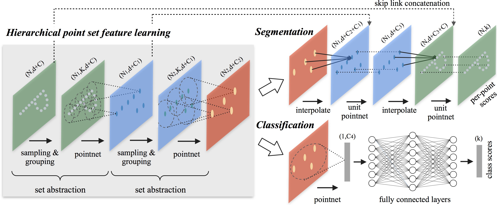 | [Pointnet++: Deep hierarchical feature learning on point sets in a metric space](https://proceedings.neurips.cc/paper/2017/hash/d8bf84be3800d12f74d8b05e9b89836f-Abstract.html) |    [Code](https://github.com/charlesq34/pointnet2)     |
|   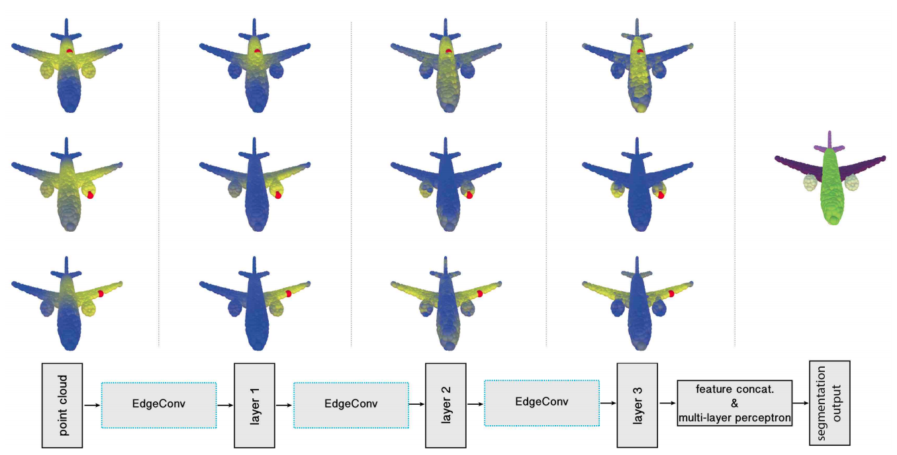   | [Dynamic graph cnn for learning on point clouds](https://dl.acm.org/doi/abs/10.1145/3326362) | [Code](https://github.com/WangYueFt/dgcnn/tree/master) |
|  | [Pointcept](https://github.com/Pointcept/Pointcept)          |     [Code](https://github.com/Pointcept/Pointcept)     |

## 常用数据集

|                    预览                    | 论文名称                                                     |                        相关链接                         |
| :----------------------------------------: | :----------------------------------------------------------- | :-----------------------------------------------------: |
|    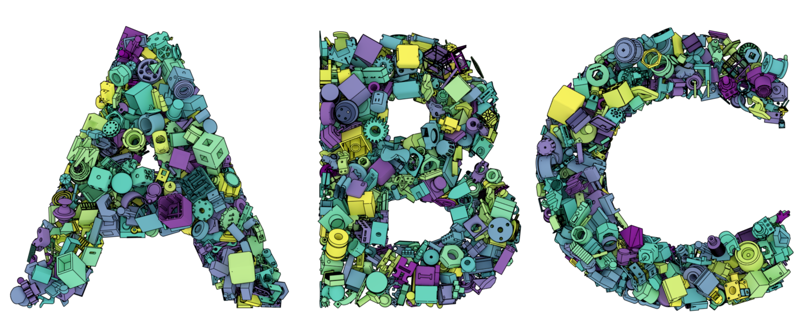     | [Abc: A big cad model dataset for geometric deep learning](http://openaccess.thecvf.com/content_CVPR_2019/html/Koch_ABC_A_Big_CAD_Model_Dataset_for_Geometric_Deep_Learning_CVPR_2019_paper.html) | [Project](https://deep-geometry.github.io/abc-dataset/) |
| 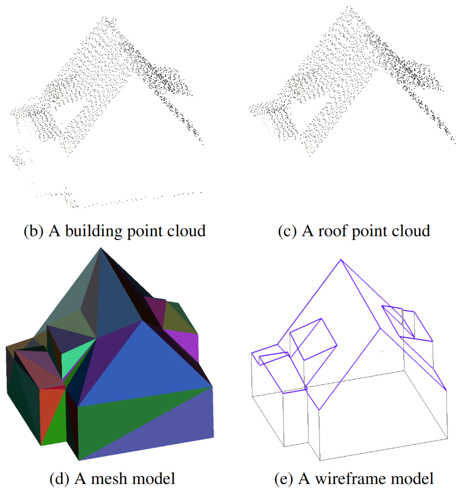 | [Building3d: A urban-scale dataset and benchmarks for learning roof structures from point clouds](http://openaccess.thecvf.com/content/ICCV2023/html/Wang_Building3D_A_Urban-Scale_Dataset_and_Benchmarks_for_Learning_Roof_Structures_ICCV_2023_paper.html) |       [Project](https://building3d.ucalgary.ca/)        |
| 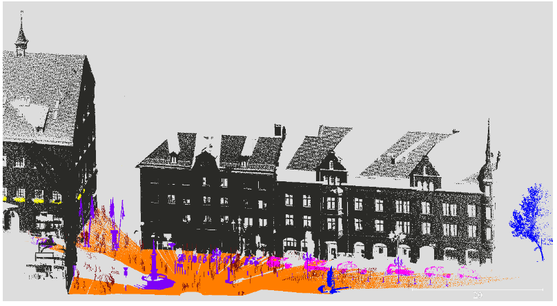 | [Semantic3d. net: A new large-scale point cloud classification benchmark](https://arxiv.org/abs/1704.03847) |                [Project](semantic3d.net)                |
|    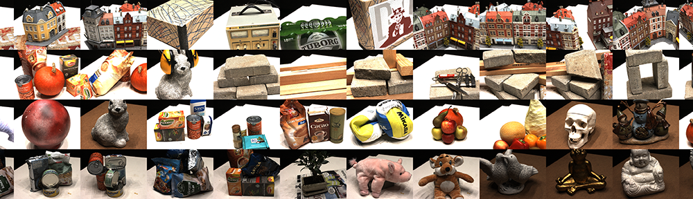     | [Large-scale data for multiple-view stereopsis](https://link.springer.com/article/10.1007/s11263-016-0902-9) |    [Project](https://roboimagedata.compute.dtu.dk/)     |
| 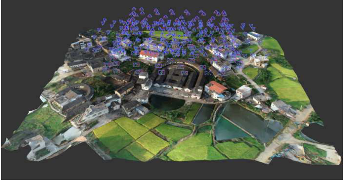 | [Blendedmvs: A large-scale dataset for generalized multi-view stereo networks](http://openaccess.thecvf.com/content_CVPR_2020/html/Yao_BlendedMVS_A_Large-Scale_Dataset_for_Generalized_Multi-View_Stereo_Networks_CVPR_2020_paper.html) |    [Project](https://github.com/YoYo000/BlendedMVS)     |
|  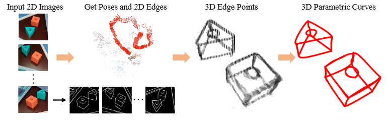   | [Nef: Neural edge fields for 3d parametric curve reconstruction from multi-view images](http://openaccess.thecvf.com/content/CVPR2023/html/Ye_NEF_Neural_Edge_Fields_for_3D_Parametric_Curve_Reconstruction_From_CVPR_2023_paper.html) |      [Project](https://yunfan1202.github.io/NEF/)       |

## 部分技术和算法源代码

|                      预览                      | 论文名称                                                     |                           相关链接                           |
| :--------------------------------------------: | :----------------------------------------------------------- | :----------------------------------------------------------: |
|      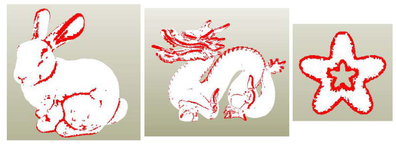      | [Fast and robust edge extraction in unorganized point clouds](https://ieeexplore.ieee.org/abstract/document/7371262/) |   [Code](https://github.com/denabazazian/Edge_Extraction)    |
|      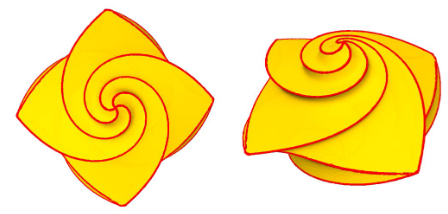       | [Voronoi-based feature curves extraction for sampled singular surfaces](https://www.sciencedirect.com/science/article/pii/S0097849313000885) | [Code](https://doc.cgal.org/latest/Point_set_processing_3/group__PkgPointSetProcessing3Algorithms.html#gaf1e415a68652535215c60bc52ebacca3) |
|      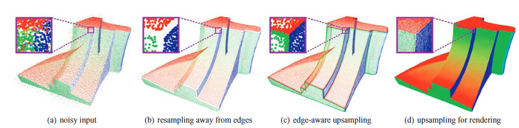       | [Edge-aware point set resampling](https://dl.acm.org/doi/abs/10.1145/2421636.2421645) | [Code](https://doc.cgal.org/4.11/Point_set_processing_3/Point_set_processing_3_2edge_aware_upsample_point_set_example_8cpp-example.html) |
|      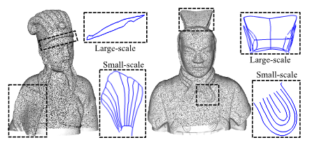      | [Multiscale feature line extraction from raw point clouds based on local surface variation and anisotropic contraction](https://ieeexplore.ieee.org/abstract/document/9351738/) | [Code](https://github.com/chenhonghua/Feature-line-extraction) |
|     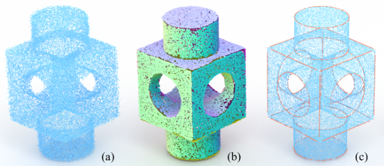      | [Rfeps: Reconstructing feature-line equipped polygonal surface](https://dl.acm.org/doi/abs/10.1145/3550454.3555443) |           [Code](https://github.com/Xrvitd/RFEPS)            |
|     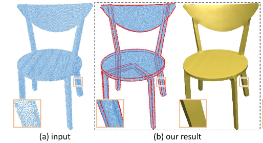     | [Ec-net: an edge-aware point set consolidation network](http://openaccess.thecvf.com/content_ECCV_2018/html/Lequan_Yu_EC-Net_an_Edge-aware_ECCV_2018_paper.html) |          [Code](https://github.com/yulequan/EC-Net)          |
|      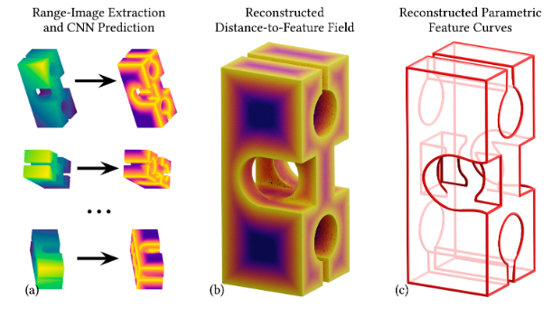       | [Def: Deep estimation of sharp geometric features in 3d shapes](https://dl.acm.org/doi/abs/10.1145/3528223.3530140) |           [Code](https://github.com/artonson/def)            |
|    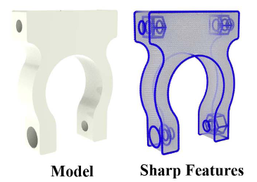     | [MSL-Net: Sharp feature detection network for 3D point clouds](https://ieeexplore.ieee.org/abstract/document/10373950/) | [Code](https://github.com/XianheJiao/Sharp-feature-detection-in-point-cloud-) |
|   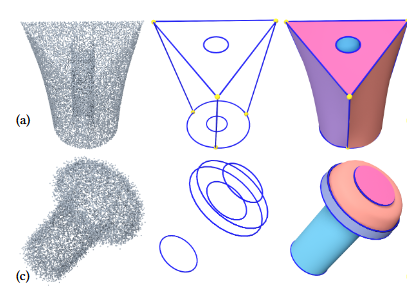   | [Complexgen: Cad reconstruction by b-rep chain complex generation](https://dl.acm.org/doi/abs/10.1145/3528223.3530078) |      [Code](https://github.com/guohaoxiang/ComplexGen)       |
|      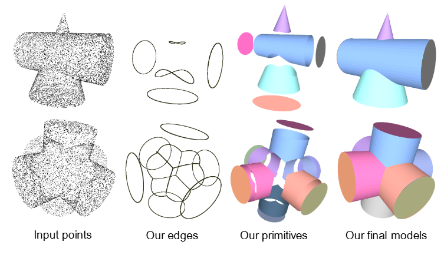       | [Surface and edge detection for primitive fitting of point clouds](https://dl.acm.org/doi/abs/10.1145/3588432.3591522) |        [Code](https://github.com/yuanqili78/SED-Net)         |
|    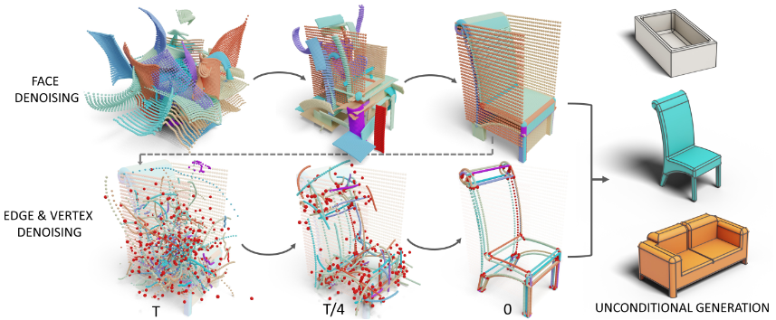     | [Brepgen: A b-rep generative diffusion model with structured latent geometry](https://dl.acm.org/doi/abs/10.1145/3658129) |        [Code](https://github.com/samxuxiang/BrepGen)         |
| 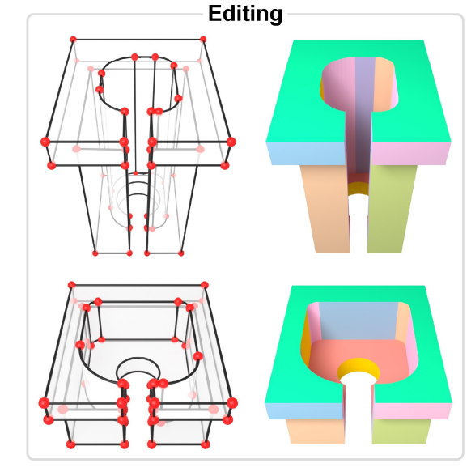  | [Split-and-fit: Learning b-reps via structure-aware voronoi partitioning](https://dl.acm.org/doi/abs/10.1145/3658155) |         [Code](https://github.com/yilinliu77/NVDNet)         |
|      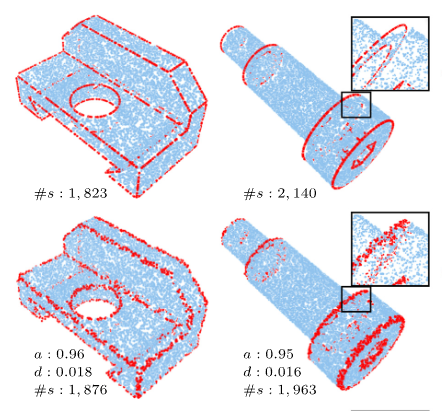       | [Sharp feature consolidation from raw 3D point clouds via displacement learning](https://www.sciencedirect.com/science/article/pii/S0167839623000365) |         [Code](https://github.com/Tong-ZHAO/SFCNet)          |
|   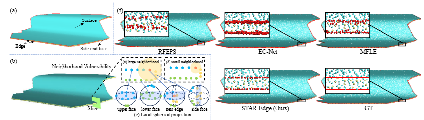    | [STAR-Edge: Structure-aware Local Spherical Curve Representation for Thin-walled Edge Extraction from Unstructured Point Clouds](https://openaccess.thecvf.com/content/CVPR2025/html/Li_STAR-Edge_Structure-aware_Local_Spherical_Curve_Representation_for_Thin-walled_Edge_Extraction_CVPR_2025_paper.html) |       [Code](https://github.com/Miraclelzk/STAR-Edge)        |
|      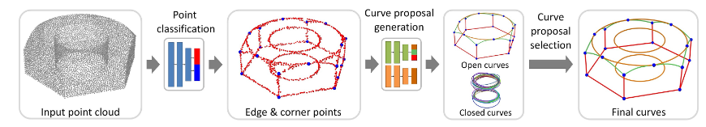       | [Pie-net: Parametric inference of point cloud edges](https://proceedings.neurips.cc/paper/2020/hash/e94550c93cd70fe748e6982b3439ad3b-Abstract.html) |      [Code](https://github.com/wangxiaogang866/PIE-NET)      |
|     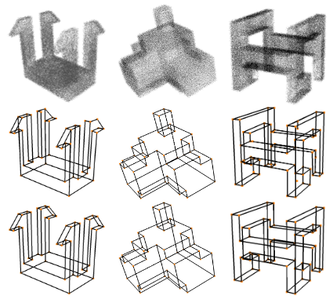      | [Pc2wf: 3d wireframe reconstruction from raw point clouds](https://arxiv.org/abs/2103.02766) |         [Code](https://github.com/YujiaLiu76/PC2WF)          |
|     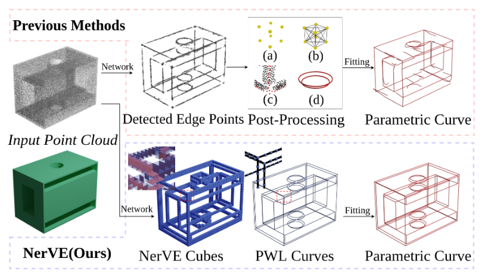      | [Nerve: Neural volumetric edges for parametric curve extraction from point cloud](http://openaccess.thecvf.com/content/CVPR2023/html/Zhu_NerVE_Neural_Volumetric_Edges_for_Parametric_Curve_Extraction_From_Point_CVPR_2023_paper.html) |           [Code](https://github.com/uhzoaix/NerVE)           |
|    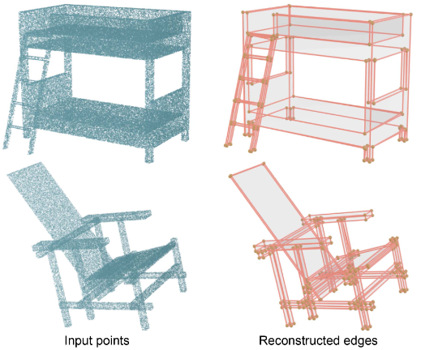    | [Deep Point Cloud Edge Reconstruction Via Surface Patch Segmentation](https://ieeexplore.ieee.org/abstract/document/10909144/) |         [Code](https://github.com/JAJASONW/PCER-Net)         |
|     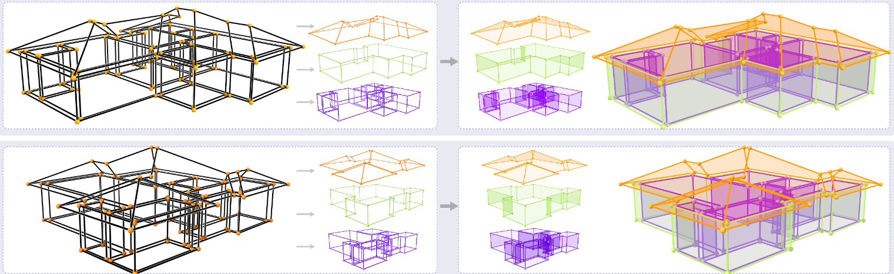     | [Generating 3D House Wireframes with Semantics](https://link.springer.com/chapter/10.1007/978-3-031-72670-5_13) |     [Code](https://github.com/3d-house-wireframe/3dwire)     |
|    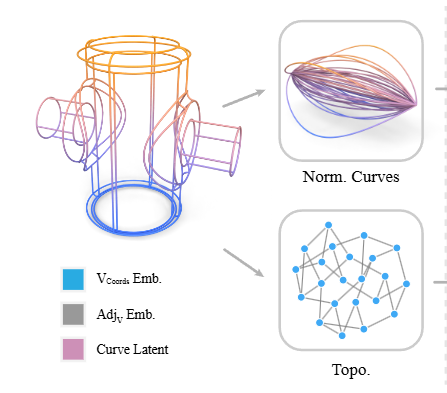     | [Clr-wire: Towards continuous latent representations for 3d curve wireframe generation](https://dl.acm.org/doi/abs/10.1145/3721238.3730638) |         [Code](https://github.com/qixuema/CLR-Wire)          |
|      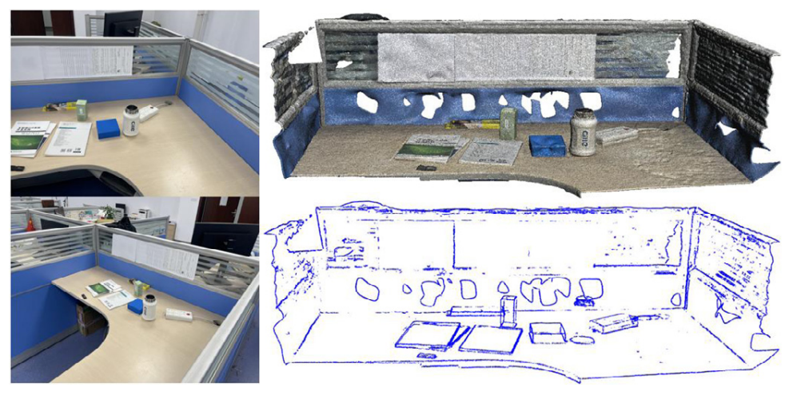      | [Robust and accurate feature detection on point clouds](https://www.sciencedirect.com/science/article/pii/S0010448523001240) | [Code](https://github.com/felixzhao0116/Robust-and-Accurate-Feature-Detection-on-Point-Clouds) |
|   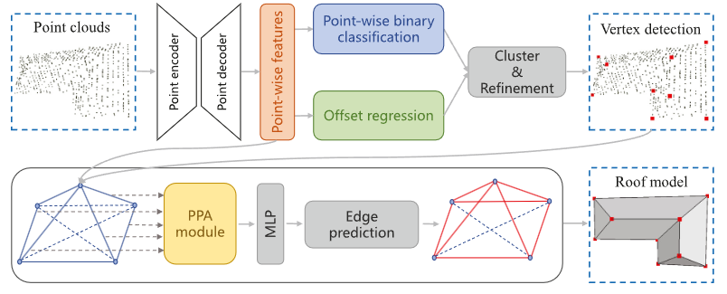   | [Point2Roof: End-to-end 3D building roof modeling from airborne LiDAR point clouds](https://www.sciencedirect.com/science/article/pii/S0924271622002362) |       [Code](https://github.com/Li-Li-Whu/Point2Roof)        |
|     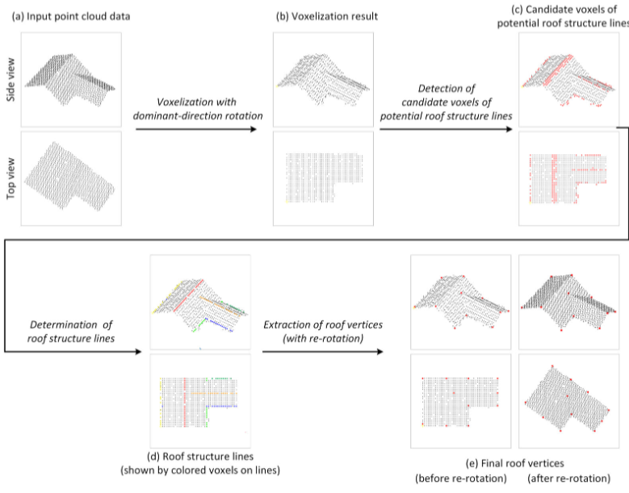     | [Detecting vertices of building roofs from ALS point cloud data](https://www.tandfonline.com/doi/abs/10.1080/17538947.2023.2283486) |       [Code](https://github.com/Alessiacosmos/RoofVE)        |
|    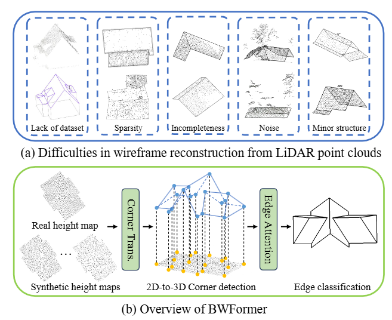    | [BWFormer: Building Wireframe Reconstruction from Airborne LiDAR Point Cloud with Transformer](https://openaccess.thecvf.com/content/CVPR2025/html/Liu_BWFormer_Building_Wireframe_Reconstruction_from_Airborne_LiDAR_Point_Cloud_with_CVPR_2025_paper.html) |        [Code](https://github.com/3dv-casia/BWformer)         |
| 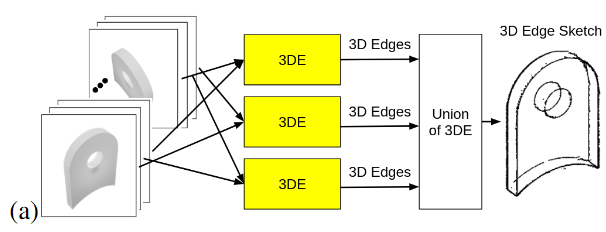 | [3D Edge Sketch from Multiview Images](https://ieeexplore.ieee.org/abstract/document/10943943/) |     [Code](https://github.com/C-H-Chien/3D_Edge_Sketch)      |
|      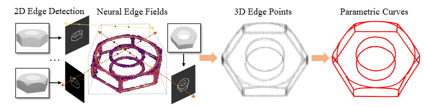       | [Nef: Neural edge fields for 3d parametric curve reconstruction from multi-view images](http://openaccess.thecvf.com/content/CVPR2023/html/Ye_NEF_Neural_Edge_Fields_for_3D_Parametric_Curve_Reconstruction_From_CVPR_2023_paper.html) |        [Code](https://github.com/yunfan1202/NEF_code)        |
|      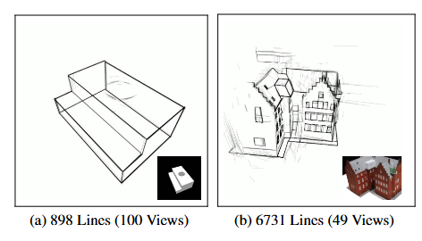      | [Neat: Distilling 3d wireframes from neural attraction fields](http://openaccess.thecvf.com/content/CVPR2024/html/Xue_NEAT_Distilling_3D_Wireframes_from_Neural_Attraction_Fields_CVPR_2024_paper.html) |          [Code](https://github.com/cherubicxn/neat)          |
|      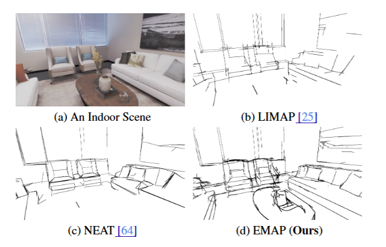      | [3d neural edge reconstruction](http://openaccess.thecvf.com/content/CVPR2024/html/Li_3D_Neural_Edge_Reconstruction_CVPR_2024_paper.html) |             [Code](https://github.com/cvg/EMAP)              |
|     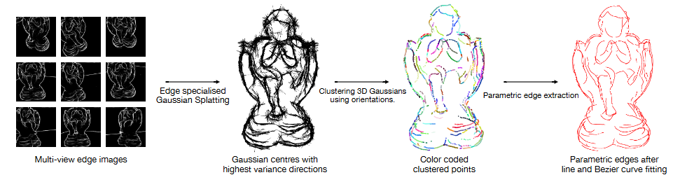     | [EdgeGaussians-3D Edge Mapping via Gaussian Splatting](https://ieeexplore.ieee.org/abstract/document/10943309/) |    [Code](https://github.com/kunalchelani/EdgeGaussians)     |
|    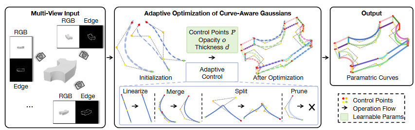     | [Curve-Aware Gaussian Splatting for 3D Parametric Curve Reconstruction](https://arxiv.org/abs/2506.21401) |     [Code](https://github.com/zhirui-gao/Curve-Gaussian)     |
|      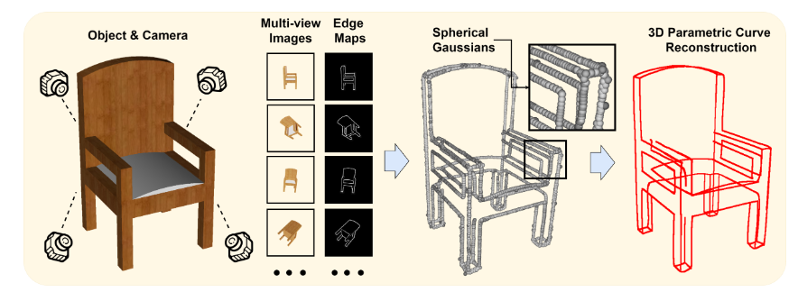      | [SGCR: Spherical Gaussians for Efficient 3D Curve Reconstruction](https://openaccess.thecvf.com/content/CVPR2025/html/Yang_SGCR_Spherical_Gaussians_for_Efficient_3D_Curve_Reconstruction_CVPR_2025_paper.html) |          [Code](https://github.com/Martinyxr/SGCR)           |

## 相关文献列表

### 一、基于网格的三维线框生成方法

#### 1.1 基于曲率估计的谷脊线检测

1. [Solid shape](https://mitpress.mit.edu/9780262111393/)
2. [Ridge curves and shape analysis](https://www.bmva-archive.org.uk/bmvc/1996/kent_1.pdf)
3. [Extraction of feature lines on triangulated surfaces using morphological operators](https://aaai.org/papers/0012-SS00-04-012-extraction-of-feature-lines-on-triangulated-surfaces-using-morphological-operators/)
4. [Detection of salient curvature features on polygonal surfaces](https://onlinelibrary.wiley.com/doi/full/10.1111/1467-8659.00531)
5. [Normal vector voting: crease detection and curvature estimation on large, noisy meshes](https://www.sciencedirect.com/science/article/pii/S1524070302905746)
6. [The implicit structure of ridges of a smooth parametric surface](https://www.sciencedirect.com/science/article/pii/S0167839606000410)
7. [Ridge-valley lines on meshes via implicit surface fitting](https://dl.acm.org/doi/10.1145/1015706.1015768)
8. [Fast and Robust Detection of Crest Lines on Meshes](https://www2.riken.jp/brict/Yoshizawa/Papers/spm05ybs.pdf)
9. [Smooth Feature Lines on Surface Meshes](https://diglib.eg.org/items/860abe10-40fd-4436-bae1-7db8f05df494)
10. [Estimating Curvatures and Their Derivatives on Triangle Meshes](https://gfx.cs.princeton.edu/pubs/Rusinkiewicz_2004_ECA/curvpaper.pdf)
11. [Functional Optimization for Fair Surface Design](https://people.eecs.berkeley.edu/~sequin/CS284/TEXT/p167-moreton.pdf)
12. [Large Deformable Splines, Crest Lines and Matching](https://ieeexplore.ieee.org/abstract/document/378150)
13. [Finding Ridges and Valleys in a Discrete Surface Using a Modified MLS Approximation](https://www.sciencedirect.com/science/article/abs/pii/S0010448505001806)
14. [Fast, Robust, and Faithful Methods for Detecting Crest Lines on Meshes](https://www.sciencedirect.com/science/article/pii/S0167839608000435)
15. [Separatrix Persistence: Extraction of Salient Edges on Surfaces Using Topological Methods](https://onlinelibrary.wiley.com/doi/abs/10.1111/j.1467-8659.2009.01528.x)
16. [Feature Detection of Triangular Meshes Based on Tensor Voting Theory](https://www.sciencedirect.com/science/article/abs/pii/S0010448508002297)
17. [Demarcating Curves for Shape Illustration](https://dl.acm.org/doi/abs/10.1145/1457515.1409110)
18. [Thin nets and crest lines: Application to satellite data and medical images](https://www.sciencedirect.com/science/article/pii/S107731429690507X)
19. [The 3D marching lines algorithm](https://www.sciencedirect.com/science/article/pii/S1077316996900428)
20. [Extracting line representations of sulcal and gyral patterns in MR images of the human brain](https://ieeexplore.ieee.org/abstract/document/746714/)
21. [Using a statistical shape model to extract sulcal curves on the outer cortex of the human brain](https://ieeexplore.ieee.org/abstract/document/1009387/)
22. [Crest lines for surface segmentation and flattening](https://dl.acm.org/doi/abs/10.1109/TVCG.2004.24)
23. [Learning line features in 3D geometry](https://onlinelibrary.wiley.com/doi/abs/10.1111/j.1467-8659.2011.01858.x)
24. [Feature curve co-completion in noisy data](https://onlinelibrary.wiley.com/doi/abs/10.1111/cgf.13337)

#### 1.2 基于网格分割的特征曲线检测

1. [A general and efficient method for finding cycles in 3D curve networks](https://dl.acm.org/doi/10.1145/2508363.2508423)
2. [Flow aligned surfacing of curve networks](https://dl.acm.org/doi/10.1145/2766990)
3. [FlowRep: Descriptive curve networks for free-form design shapes](https://dl.acm.org/doi/10.1145/3072959.3073639)
4. [Cassie: Curve and surface sketching in immersive environments](https://dl.acm.org/doi/10.1145/3411764.3445158)
5. [Strokes2Surface: Recovering curve networks from 4D architectural design sketches](https://onlinelibrary.wiley.com/doi/abs/10.1111/cgf.15054)
6. [Fibermesh: Designing freeform surfaces with 3D curves](https://dl.acm.org/doi/10.1145/1276377.1276429)
7. [Segmentation through variable-order surface fitting](https://www.cs.hunter.cuny.edu/~ioannis/3DP_F03/PAPERS/SEGMENTATION/besl_jain.pdf)
8. [High-level CAD model acquisition from range images](https://www.sciencedirect.com/science/article/pii/S0010448596000590)
9. [Variational shape approximation](https://dl.acm.org/doi/abs/10.1145/1186562.1015817)
10. [Structure Recovery via Hybrid Variational Surface Approximation](https://www.graphics.rwth-aachen.de/publication/87/hybrid1.pdf)
11. [Quadric surface extraction by variational shape approximation](https://link.springer.com/chapter/10.1007/11802914_6)
12. [Variational mesh segmentation via quadric surface fitting](https://www.sciencedirect.com/science/article/pii/S0010448512000887)
13. [Interactive segmentation of scanned mechanical models based on quadratic surfaces fitting](https://www.jcad.cn/en/article/doi/10.3724/SP.J.1089.2019.17508)
14. [Extraction and remeshing of ellipsoidal representations from mesh data](https://www.cs.toronto.edu/~psimari/publications/2005_gi_simari_singh.pdf)
15. [D-Charts: Quasi-Developable Mesh Segmentation](https://openurl.ebsco.com/EPDB%3Agcd%3A11%3A23907611/detailv2?sid=ebsco%3Aplink%3Ascholar-a&id=ebsco%3Agcd%3A18272051&crl=c&jrnl=01677055&id_token_hint=eyJraWQiOiIxNjg2MTQ5MjEzNjMxIiwiYWxnIjoiUlMyNTYifQ.eyJzdWIiOiJzMzg5NDEzMC5tYWluIiwiZGV2aWNlX2lkIjoiNTUxNjQ3OTItY2FlZC00OGIwLTg2MTMtZjJlYjI5ZGJkY2VlIiwiYW1yIjpbImlwIl0sImlzcyI6Imh0dHBzOlwvXC9hdXRoLmVic2NvLnpvbmVcL2FwaVwvZGlzcGF0Y2hlciIsImNsaWVudF9pZCI6ImF3Z3ljSXg1N01yd25EUTVoNFVlNnlDVkVQMHI1TXQ5IiwiYXVkIjpbImh0dHBzOlwvXC9hdXRoLmVic2NvLnpvbmVcL2FwaVwvZGlzcGF0Y2hlciIsImh0dHA6XC9cL2F1dGgtY3h0LW1nci5laG9zdC1saXZlLmVrcy5laG9zdC1saXZlLmVpc2x6LmNvbSIsImh0dHBzOlwvXC9hY2Nlc3MtYXBpLmVic2NvLmNvbSIsImF3Z3ljSXg1N01yd25EUTVoNFVlNnlDVkVQMHI1TXQ5Il0sImF6cCI6ImF3Z3ljSXg1N01yd25EUTVoNFVlNnlDVkVQMHI1TXQ5IiwiaWR0IjoiaW5zdGl0dXRpb25hbCIsImV4cCI6MTc2MDYyODUwMSwiaWF0IjoxNzYwNjI0OTAxLCJjbGllbnRfbmFtZSI6IldlYmF1dGggLSBOZXcgRURTIGlkX3Rva2VuIiwianRpIjoiYjMwOTY2N2UtOWZhYS00ODRiLWI3ZDQtYjg1ZjA4Mzc4ZWQ0IiwidXNlcm5hbWUiOiJJbnN0aXR1dGlvbmFsVXNlciJ9.SU685yBYb62AweEc8810G9HOvFBnBnPZirmIY-D1zDi3HwX29Jo0qR1BhQORU-hSEpf5c98er4cm6bW0wFmLBUYA2GQvzWBu4yHGzbbOc56-QAu8KodMuwfh-yPqCoF3s7nVe4h2ANROchYL6OLf9_5K6H8BLb90yw_k01BfCpSyLmN11_YLkigZbx3jSILy-hsaXqJhnt_B3s58Nf-LU_L87x3nYwvPdgN0ItTQfJZfW66xCunxVVi4fYkPhPTjBhsHkzDMjXRwOAMzQ-zsxdT3gjNE9LLjrF4Y2PkiRDoYYHonuSoZvlgpOBUD8fhPFcBJytL3jeEWR8bD6DSj1g&link_origin=scholar.google.com.hk)
16. [Blending surface segmentation and editing for 3D models](https://ieeexplore.ieee.org/abstract/document/9296787)
17. [Hierarchical mesh segmentation based on fitting primitives](https://link.springer.com/article/10.1007/s00371-006-0375-x)
18. [Hierarchical mesh decomposition using fuzzy clustering and cuts](https://dl.acm.org/doi/abs/10.1145/882262.882369)
19. [A new CAD mesh segmentation method, based on curvature tensor analysis](https://www.sciencedirect.com/science/article/pii/S0010448504002003)
20. [Abstraction of man-made shapes](https://dl.acm.org/doi/abs/10.1145/1661412.1618483)
21. [Adapting feature curve networks to a prescribed scale](https://onlinelibrary.wiley.com/doi/abs/10.1111/cgf.12834)
22. [iWIRES: An analyze-and-edit approach to shape manipulation](https://dl.acm.org/doi/abs/10.1145/1576246.1531339)
23. [Exoskeleton: Curve network abstraction for 3D shapes](https://www.sciencedirect.com/science/article/pii/S0097849310001810)
24. [Recognition of feature curves on 3D shapes using an algebraic approach to Hough transforms](https://www.sciencedirect.com/science/article/pii/S0031320317303096)
25. [Patch layout generation by detecting feature networks](https://www.sciencedirect.com/science/article/pii/S0097849314001101)
26. [Extracting cycle-aware feature curve networks from 3D models](https://www.sciencedirect.com/science/article/pii/S0010448520301421)
27. [Feature-aligned segmentation using correlation clustering](https://ieeexplore.ieee.org/abstract/document/10897514)
28. [Seg-mat: 3D shape segmentation using medial axis transform](https://ieeexplore.ieee.org/abstract/document/9234096)
29. [3D Shape Segmentation with Potential Consistency Mining and Enhancement](https://ieeexplore.ieee.org/abstract/document/10814983)
30. [Patch layout from feature graphs](https://www.sciencedirect.com/science/article/pii/S0010448509002851)
31. [Extract feature curves on noisy triangular meshes](https://www.sciencedirect.com/science/article/pii/S1524070317300498)

### 二、基于点云的三维线框生成方法

#### 2.1 基于几何分析的尖锐特征检测

1. [Feature Extraction From Point Clouds](https://www.researchgate.net/profile/Stefan-Gumhold/publication/2554207_Feature_Extraction_from_Point_Clouds/links/0deec522ee1463f801000000/Feature-Extraction-from-Point-Clouds.pdf)
2. [Multi‐scale feature extraction on point‐sampled surfaces](https://onlinelibrary.wiley.com/doi/abs/10.1111/1467-8659.00675)
3. [Spline-based feature curves from point-sampled geometry](https://link.springer.com/article/10.1007/s00371-008-0223-2)
4. [Feature preserving mesh generation from 3D point clouds](https://onlinelibrary.wiley.com/doi/abs/10.1111/j.1467-8659.2010.01771.x)
5. [Sharp feature preserving MLS surface reconstruction based on local feature line approximations](https://www.sciencedirect.com/science/article/pii/S152407031200032X)
6. [Sharp feature detection in point clouds](https://ieeexplore.ieee.org/abstract/document/5521460/)
7. [Fast and robust edge extraction in unorganized point clouds](https://ieeexplore.ieee.org/abstract/document/7371262/)
8. [Feature‐preserving reconstruction of singular surfaces](https://onlinelibrary.wiley.com/doi/abs/10.1111/j.1467-8659.2012.03183.x)
9. [Robust moving least-squares fitting with sharp features](https://dl.acm.org/doi/abs/10.1145/1073204.1073227)
10. [Data-dependent MLS for faithful surface approximation](https://dl.acm.org/doi/abs/10.5555/1281991.1281999)
11. [Voronoi-based feature curves extraction for sampled singular surfaces](https://www.sciencedirect.com/science/article/pii/S0097849313000885)
12. [Patch-graph reconstruction for piecewise smooth surfaces](https://www.google.com/books?hl=zh-CN&lr=&id=WCVFWYlAeCMC&oi=fnd&pg=PA3&dq=Patch-graph+reconstruction+for+piecewise+smooth+surfaces&ots=QDKiVh40M-&sig=J6VqqWfIGI9zdC067UGE6uCBfrs)
13. [Feature preserving point set surfaces based on non‐linear kernel regression](https://onlinelibrary.wiley.com/doi/abs/10.1111/j.1467-8659.2009.01388.x)
14. [Multi-scale tensor voting for feature extraction from unstructured point clouds](https://www.sciencedirect.com/science/article/pii/S1524070312000288)
15. [A feature-preserving framework for point cloud denoising](https://www.sciencedirect.com/science/article/pii/S0010448520300506)
16. [Voronoi-based curvature and feature estimation from point clouds](https://ieeexplore.ieee.org/abstract/document/5669298/)
17. [SGLBP: Subgraph‐based local binary patterns for feature extraction on point clouds](https://onlinelibrary.wiley.com/doi/abs/10.1111/cgf.14500)
18. [Extracting feature lines from point clouds based on smooth shrink and iterative thinning](https://www.sciencedirect.com/science/article/pii/S1524070316300054)
19. [Neighbor reweighted local centroid for geometric feature identification](https://ieeexplore.ieee.org/abstract/document/9600876/)
20. [An adaptive normal estimation method for scanned point clouds with sharp features](https://www.sciencedirect.com/science/article/pii/S0010448513001000)
21. [A statistical approach for extraction of feature lines from point clouds](https://www.sciencedirect.com/science/article/pii/S0097849316300097)
22. [Edge and corner detection for unorganized 3d point clouds with application to robotic welding](https://ieeexplore.ieee.org/abstract/document/8593910/)
23. [Multiscale feature line extraction from raw point clouds based on local surface variation and anisotropic contraction](https://ieeexplore.ieee.org/abstract/document/9351738/)
24. [Rfeps: Reconstructing feature-line equipped polygonal surface](https://dl.acm.org/doi/abs/10.1145/3550454.3555443)

#### 2.2 基于深度学习的CAD模型三维线框生成

1. [Contour detection in unstructured 3D point clouds](https://www.cv-foundation.org/openaccess/content_cvpr_2016/html/Hackel_Contour_Detection_in_CVPR_2016_paper.html)
2. [Edge-aware point set resampling](https://dl.acm.org/doi/abs/10.1145/2421636.2421645)
3. [Ec-net: an edge-aware point set consolidation network](http://openaccess.thecvf.com/content_ECCV_2018/html/Lequan_Yu_EC-Net_an_Edge-aware_ECCV_2018_paper.html)
4. [Learning part boundaries from 3D point clouds](https://onlinelibrary.wiley.com/doi/abs/10.1111/cgf.14078)
5. [Def: Deep estimation of sharp geometric features in 3d shapes](https://dl.acm.org/doi/abs/10.1145/3528223.3530140)
6. [MSL-Net: Sharp feature detection network for 3D point clouds](https://ieeexplore.ieee.org/abstract/document/10373950/)
7. [Complexgen: Cad reconstruction by b-rep chain complex generation](https://dl.acm.org/doi/abs/10.1145/3528223.3530078)
8. [Surface and edge detection for primitive fitting of point clouds](https://dl.acm.org/doi/abs/10.1145/3588432.3591522)
9. [Brepgen: A b-rep generative diffusion model with structured latent geometry](https://dl.acm.org/doi/abs/10.1145/3658129)
10. [Split-and-fit: Learning b-reps via structure-aware voronoi partitioning](https://dl.acm.org/doi/abs/10.1145/3658155)
11. [Hola: B-rep generation using a holistic latent representation](https://dl.acm.org/doi/abs/10.1145/3730842)
12. [B-repLer: Semantic B-rep Latent Editor using Large Language Models](https://arxiv.org/abs/2508.10201)
13. [CADDreamer: CAD Object Generation from Single-view Images](http://openaccess.thecvf.com/content/CVPR2025/html/Li_CADDreamer_CAD_Object_Generation_from_Single-view_Images_CVPR_2025_paper.html)
14. [Cmt: A cascade mar with topology predictor for multimodal conditional cad generation](https://openaccess.thecvf.com/content/ICCV2025/html/Wu_CMT_A_Cascade_MAR_with_Topology_Predictor_for_Multimodal_Conditional_ICCV_2025_paper.html)
15. [Sharp feature consolidation from raw 3D point clouds via displacement learning](https://www.sciencedirect.com/science/article/pii/S0167839623000365)
16. [Sepicnet: Sharp edges recovery by parametric inference of curves in 3d shapes](https://openaccess.thecvf.com/content/CVPR2023W/StruCo3D/html/Cherenkova_SepicNet_Sharp_Edges_Recovery_by_Parametric_Inference_of_Curves_in_CVPRW_2023_paper.html)
17. [Thin-walled aircraft panel edge extraction from 3-D measurement surfaces via feature-aware displacement learning](https://ieeexplore.ieee.org/abstract/document/10458949/)
18. [STAR-Edge: Structure-aware Local Spherical Curve Representation for Thin-walled Edge Extraction from Unstructured Point Clouds](https://openaccess.thecvf.com/content/CVPR2025/html/Li_STAR-Edge_Structure-aware_Local_Spherical_Curve_Representation_for_Thin-walled_Edge_Extraction_CVPR_2025_paper.html)
19. [Sketch2cad: Sequential cad modeling by sketching in context](https://dl.acm.org/doi/abs/10.1145/3414685.3417807)
20. [Free2cad: Parsing freehand drawings into cad commands](https://dl.acm.org/doi/abs/10.1145/3528223.3530133)
21. [Pie-net: Parametric inference of point cloud edges](https://proceedings.neurips.cc/paper/2020/hash/e94550c93cd70fe748e6982b3439ad3b-Abstract.html)
22. [Pc2wf: 3d wireframe reconstruction from raw point clouds](https://arxiv.org/abs/2103.02766)
23. [Coarse-to-fine pipeline for 3D wireframe reconstruction from point cloud](https://www.sciencedirect.com/science/article/pii/S0097849322001194)
24. [WireframeNet: A novel method for wireframe generation from point cloud](https://www.sciencedirect.com/science/article/pii/S0097849323001449)
25. [EDWG: Efficient Edge Detection and Wireframe Generation from Point Clouds](https://ieeexplore.ieee.org/abstract/document/11005571/)
26. [Nerve: Neural volumetric edges for parametric curve extraction from point cloud](http://openaccess.thecvf.com/content/CVPR2023/html/Zhu_NerVE_Neural_Volumetric_Edges_for_Parametric_Curve_Extraction_From_Point_CVPR_2023_paper.html)
27. [Deep Point Cloud Edge Reconstruction Via Surface Patch Segmentation](https://ieeexplore.ieee.org/abstract/document/10909144/)
28. [Generating 3D House Wireframes with Semantics](https://link.springer.com/chapter/10.1007/978-3-031-72670-5_13)
29. [Clr-wire: Towards continuous latent representations for 3d curve wireframe generation](https://dl.acm.org/doi/abs/10.1145/3721238.3730638)

#### 2.3 面向遥感点云的三维线框生成

##### 2.3.1 面向大型建筑物三维点云的线段检测

1. [Edge detection and feature line tracing in 3D-point clouds by analyzing geometric properties of neighborhoods](https://www.mdpi.com/2072-4292/8/9/710)
2. [Line segment extraction for large scale unorganized point clouds](https://www.sciencedirect.com/science/article/pii/S0924271615000362)
3. [Geometric feature enhanced line segment extraction from large-scale point clouds with hierarchical topological optimization](https://www.sciencedirect.com/science/article/pii/S1569843222000607)
4. [Facet segmentation-based line segment extraction for large-scale point clouds](https://ieeexplore.ieee.org/abstract/document/7945251/)
5. [Vision-based localization using an edge map extracted from 3D laser range data](https://ieeexplore.ieee.org/abstract/document/5509517/)
6. [Line-based extrinsic calibration of range and image sensors](https://ieeexplore.ieee.org/abstract/document/6631095/)
7. [Topologically aware building rooftop reconstruction from airborne laser scanning point clouds](https://ieeexplore.ieee.org/abstract/document/8025472/)
8. [Robust and accurate feature detection on point clouds](https://www.sciencedirect.com/science/article/pii/S0010448523001240)
9. [Large-scale point cloud contour extraction via 3D guided multi-conditional generative adversarial network](https://www.sciencedirect.com/science/article/pii/S0924271620300940)
10. [Superline3d: Self-supervised line segmentation and description for lidar point cloud](https://link.springer.com/chapter/10.1007/978-3-031-20077-9_16)
11. [Feature line generation and regularization from point clouds](https://ieeexplore.ieee.org/abstract/document/8793229/)
12. [Detection of closed sharp edges in point clouds using normal estimation and graph theory](https://www.sciencedirect.com/science/article/pii/S0010448506002260)
13. [PECo: A Point-Edge Collaborative Framework for Global-Aware Urban Building Contouring From Unstructured Point Clouds](https://ieeexplore.ieee.org/abstract/document/10360156/)
14. [Extracting 3-D structural lines of building from ALS point clouds using graph neural network embedded with corner information](https://ieeexplore.ieee.org/abstract/document/10130341/)
15. [LCE-NET: Contour extraction for large-scale 3-D point clouds](https://ieeexplore.ieee.org/abstract/document/10251999/)
16. [Accurate and complete line segment extraction for large-scale point clouds](https://www.sciencedirect.com/science/article/pii/S1569843224000827)

##### 2.3.2 面向机载LiDAR点云的屋顶线框生成

1. [3D building detection and modeling from aerial LIDAR data](https://ieeexplore.ieee.org/abstract/document/1641024/)
2. [Model driven reconstruction of roofs from sparse LIDAR point clouds](https://www.sciencedirect.com/science/article/pii/S0924271612002043)
3. [Flexible building primitives for 3D building modeling](https://www.sciencedirect.com/science/article/pii/S0924271615000143)
4. [Self-supervised pre-training for 3-D roof reconstruction on LiDAR data](https://ieeexplore.ieee.org/abstract/document/10423095/)
5. [Point2Roof: End-to-end 3D building roof modeling from airborne LiDAR point clouds](https://www.sciencedirect.com/science/article/pii/S0924271622002362)
6. [Detecting vertices of building roofs from ALS point cloud data](https://www.tandfonline.com/doi/abs/10.1080/17538947.2023.2283486)
7. [Self-Supervised Pretraining Framework for Extracting Global Structures From Building Point Clouds via Completion](https://ieeexplore.ieee.org/abstract/document/10713355/)
8. [PBWR: Parametric-building-wireframe reconstruction from aerial LiDAR point clouds](https://openaccess.thecvf.com/content/CVPR2024/html/Huang_PBWR_Parametric-Building-Wireframe_Reconstruction_from_Aerial_LiDAR_Point_Clouds_CVPR_2024_paper.html)
9. [RR-Net: 3D Roof Reconstruction from Airborne LiDAR Point Clouds via Edge Segmentation and Wireframe Generation](https://ieeexplore.ieee.org/abstract/document/11218167/)
10. [BWFormer: Building Wireframe Reconstruction from Airborne LiDAR Point Cloud with Transformer](https://openaccess.thecvf.com/content/CVPR2025/html/Liu_BWFormer_Building_Wireframe_Reconstruction_from_Airborne_LiDAR_Point_Cloud_with_CVPR_2025_paper.html)
11. [EdgeDiff: Edge-aware Diffusion Network for Building Reconstruction from Point Clouds](https://openaccess.thecvf.com/content/CVPR2025/html/Liu_EdgeDiff_Edge-aware_Diffusion_Network_for_Building_Reconstruction_from_Point_Clouds_CVPR_2025_paper.html)

### 三、基于图像的三维线框生成方法

#### 3.1 基于结构光恢复的三维线段检测

1. [Structure-from-motion using lines: Representation, triangulation, and bundle adjustment](https://www.sciencedirect.com/science/article/pii/S1077314205000846)
2. [Exploiting global connectivity constraints for reconstruction of 3D line segments from images](https://ieeexplore.ieee.org/abstract/document/5539781/)
3. [Line-based 3D reconstruction of wiry objects](https://graz.elsevierpure.com/en/publications/line-based-3d-reconstruction-of-wiry-objects)
4. [Incremental Line-based 3D Reconstruction using Geometric Constraints](https://graz.elsevierpure.com/files/87144577/hofer_bmvc2013.pdf)
5. [Semi-Global 3D Line Modeling for Incremental Structure-from-Motion](https://www.researchgate.net/profile/Manuel-Hofer-4/publication/266139858_Semi-Global_3D_Line_Modeling_for_Incremental_Structure-from-Motion/links/54267b020cf238c6ea779465/Semi-Global-3D-Line-Modeling-for-Incremental-Structure-from-Motion.pdf)
6. [Improving sparse 3D models for man-made environments using line-based 3D reconstruction](https://ieeexplore.ieee.org/abstract/document/7035867/)
7. [Efficient 3D scene abstraction using line segments](https://www.sciencedirect.com/science/article/pii/S1077314216300236)
8. [ELSR: Efficient line segment reconstruction with planes and points guidance](http://openaccess.thecvf.com/content/CVPR2022/html/Wei_ELSR_Efficient_Line_Segment_Reconstruction_With_Planes_and_Points_Guidance_CVPR_2022_paper.html)

#### 3.2 基于多视图立体视觉的三维线段生成

1. [Structure and motion from line segments in multiple images](https://ieeexplore.ieee.org/abstract/document/473228/)
2. [Matching, reconstructing and grouping 3d lines from multiple views using uncertain projective geometry](https://ieeexplore.ieee.org/abstract/document/991006/)
3. [Multi-view stereo 3D edge reconstruction](https://ieeexplore.ieee.org/abstract/document/8354204/)
4. [SOLD2: Self-supervised occlusion-aware line description and detection](http://openaccess.thecvf.com/content/CVPR2021/html/Pautrat_SOLD2_Self-Supervised_Occlusion-Aware_Line_Description_and_Detection_CVPR_2021_paper.html)
5. [Deeplsd: Line segment detection and refinement with deep image gradients](http://openaccess.thecvf.com/content/CVPR2023/html/Pautrat_DeepLSD_Line_Segment_Detection_and_Refinement_With_Deep_Image_Gradients_CVPR_2023_paper.html)
6. [3d line mapping revisited](http://openaccess.thecvf.com/content/CVPR2023/html/Liu_3D_Line_Mapping_Revisited_CVPR_2023_paper.html)
7. [Mv2cyl: Reconstructing 3d extrusion cylinders from multi-view images](https://proceedings.neurips.cc/paper_files/paper/2024/hash/35d127a008e3ea420dd1775d1e3ed5b4-Abstract-Conference.html)
8. [3D curve sketch: Flexible curve-based stereo reconstruction and calibration](https://ieeexplore.ieee.org/abstract/document/5539787/)
9. [3D Edge Sketch from Multiview Images](https://ieeexplore.ieee.org/abstract/document/10943943/)

#### 3.3 基于可微渲染的三维线框生成

1. [Nef: Neural edge fields for 3d parametric curve reconstruction from multi-view images](http://openaccess.thecvf.com/content/CVPR2023/html/Ye_NEF_Neural_Edge_Fields_for_3D_Parametric_Curve_Reconstruction_From_CVPR_2023_paper.html)
2. [3D wireframe model reconstruction of buildings from multi-view images using neural implicit fields](https://www.sciencedirect.com/science/article/pii/S0926580525001852)
3. [Neat: Distilling 3d wireframes from neural attraction fields](http://openaccess.thecvf.com/content/CVPR2024/html/Xue_NEAT_Distilling_3D_Wireframes_from_Neural_Attraction_Fields_CVPR_2024_paper.html)
4. [3d neural edge reconstruction](http://openaccess.thecvf.com/content/CVPR2024/html/Li_3D_Neural_Edge_Reconstruction_CVPR_2024_paper.html)
5. [EdgeGaussians-3D Edge Mapping via Gaussian Splatting](https://ieeexplore.ieee.org/abstract/document/10943309/)
6. [Curve-Aware Gaussian Splatting for 3D Parametric Curve Reconstruction](https://arxiv.org/abs/2506.21401)
7. [SGCR: Spherical Gaussians for Efficient 3D Curve Reconstruction](https://openaccess.thecvf.com/content/CVPR2025/html/Yang_SGCR_Spherical_Gaussians_for_Efficient_3D_Curve_Reconstruction_CVPR_2025_paper.html)